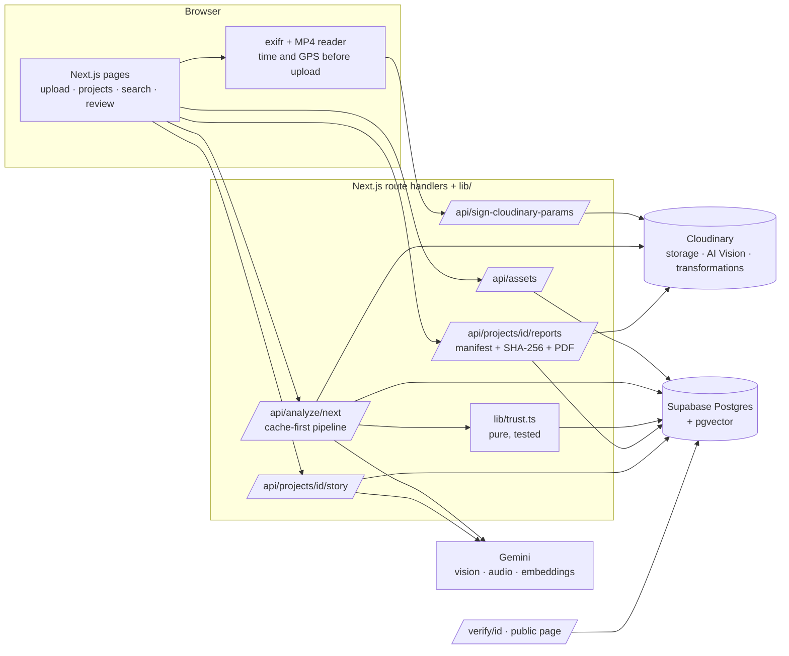

# Overlook

**An AI evidence platform for NGOs, CSR teams and government field projects.** It turns raw field photos and
videos into **verified, searchable, measurable** impact evidence, and tells you when a photo needs a second look.

Most tools build a smart photo gallery. Overlook builds an **evidence system**:

- every photo gets a **Trust Score** with plain-language reasons (duplicate, re-used, wrong place, wrong date, photo of a screen, no metadata);
- every number in a report **links to the photos behind it**;
- every report carries a **QR code** that opens a public page which recomputes the report's SHA-256 and says whether it was altered.

Built for Code Cubicle 6.0 (Problem Statement 02, Cloudinary track).

> Wording rule used everywhere in the UI: a photo is **"flagged for review"**, never called fake or fraud. Humans decide in `/review`.

---

## What it does

| Area | What you get |
|---|---|
| Field camera | **Ghost Camera** (`/capture`): the phone shows the earlier photo as a see-through overlay so the retake lines up with it, and **signs** the photo, its GPS fix and the time on the device (WebCrypto key + one-time server session). Verified captures get a "Captured live" flag; retakes pair with their original automatically and build a **time-lapse** of the spot. `npm run check-capture` runs the security checks. |
| Evidence gaps | Each project lists what is MISSING: spots with a before photo but no after, parts of the site with no photo, expected activities with no verified photo, no photos after the end date, flagged photos waiting. The **shot list** (`/capture/list`, QR on the project page) sends the field team to each spot with directions and a one-tap Ghost Camera. |
| Upload | Multi-file photo and video upload, signed and direct to Cloudinary. Location and time are read in the browser first (photo EXIF, and MP4/MOV atoms for video). Size limits are enforced before upload. |
| Analysis | One click runs a cached pipeline per photo: Gemini (caption, 6 visual signals, 3 checks) then Cloudinary AI Vision (taxonomy tags) then an embedding. Nothing is ever paid for twice. |
| Trust | Score 0-100 with explainable flags, a review queue (approve / reject) and an asset page with the evidence. |
| Projects | Auto-suggested projects (GPS + time clustering), map with geofence, timeline, manual assignment. |
| Search | Describe what you want ("garbage near the road"); semantic search plus filters (project, tag, trust, date, type) and exact-word transcript search for videos. |
| Impact | Before/after pairing with a slider and an AI change summary, and an Impact Scorecard whose every number is clickable. Optional **satellite cross-check** (Sentinel-2, same season a year apart, precomputed with `npm run satellite -- <projectId>`): says whether the change seen from space is consistent with the claim, never that it proves it. |
| Reports | Donor / CSR PDF (scorecard, pairs, evidence table, QR) plus a public verification page. CSR PDFs add a **compliance annex** (Schedule VII category, UN SDGs, evidence quality, payment stages; states it is not an independent impact assessment). |
| Pay-on-Proof | Payment stages per project ("40% on completion") that turn **ready to release** only when their verified evidence exists (photo count, tags, date window, before/after pair). A ready stage can be sealed as a **release certificate** on the verify page. |
| Claim Checker | Paste text from an NGO report: Gemini splits it into claims, a second call says which photos' descriptions directly show each claim, and each claim is marked Supported / Partly supported / **No evidence found** (never "false"). Sealed and shareable. |
| Live donor link | `/live/[projectId]` (embeddable with `?embed=1`): live numbers, payment stages, latest verified photos (faces pixelated), reel and satellite view. |
| Evidence registry | Public `/registry`: drop any photo to see whether it was used before in ANY project (same file or resized / recompressed copy), where and when first. The checked photo is deleted right after; partners can look up by MD5 only (`/api/registry/lookup?md5=`). Near-copies from another organisation are flagged with its name. |
| New fraud signals | **Impossible travel** (the same signing device at two places faster than a road journey, both photos flagged) and **declared AI-generated** (the file's C2PA / IPTC metadata says it was made with generative AI; "declares", never "proven"). |
| Money hooks | Embeddable "verified by Overlook" website badge (`/badge/<projectId>`, live verified share) and cost per verified outcome (grant / verified photos, per verified before/after spot, amount ready to release). |
| Public timestamps | Every report, certificate and claim check is anchored with **OpenTimestamps** (only the SHA-256 is sent; free; ends up in Bitcoin). The verify page shows pending / anchored-in-block-N and offers the `.json` + `.ots` files to check on opentimestamps.org. |
| Campaign | Instagram, story and **Hindi** WhatsApp cards (faces pixelated), a public impact-story page and a **highlight reel** video (Cloudinary splicing, crossfades), all built only from verified evidence. |
| Video | Transcript (Gemini), key frames every ~15 s as analyzable assets, frame-to-exact-second links, searchable spoken words. |

## Problem statement to feature map

| PS requirement | Feature | Where |
|---|---|---|
| Analyze and organize **large collections** of image **and video** | Direct-to-Cloudinary upload, background analysis with progress, cache-first AI, video key frames | `/upload`, `lib/analysis.ts`, `lib/video-processing.ts` |
| Organize by **project, location, timeline** | Auto project suggestions, map, timeline | `/dashboard`, `/projects/[id]`, `lib/geo.ts` |
| Identify projects, activities, locations, **visual signals** | Taxonomy tags, countable visual signals, EXIF/video GPS | `lib/taxonomy.ts`, `lib/gemini.ts`, `lib/exif.ts`, `lib/mp4meta.ts` |
| **Verifying** / reliable insights | Evidence Trust Score + review queue | `lib/trust.ts`, `/review`, `/assets/[id]` |
| Searchable via AI metadata, tags, **semantic discovery** | Embeddings + tag/trust/date filters + transcript search | `/search`, `lib/search.ts` |
| Compare **before and after** | Auto pairing, slider, AI change summary | `lib/pairing.ts`, `components/BeforeAfterSlider.tsx` |
| **Measurable impact** | Impact Scorecard, every number links to its photos | `lib/signals.ts`, `/projects/[id]/evidence` |
| Visual reports and summaries | PDF report | `lib/report-pdf.tsx` |
| **Traceability** to originals **and transformations** | Manifest with `public_id`, original + transformation URLs, SHA-256, QR to a public verify page | `lib/manifest.ts`, `/verify/[reportId]` |
| Campaign-ready content, **impact stories** | Social cards, Hindi card, story page | `lib/cards.ts`, `/story/[projectId]` |

## How Overlook uses Cloudinary

Cloudinary is not just storage here: it does the work on every line of the problem statement, and every place it does
is marked **✦ Cloudinary** in the app.

| PS line | What Cloudinary does | Where you see it |
|---|---|---|
| Analyze & organize large collections | Signed direct uploads with `phash`; every finding is written back onto the file as **structured metadata** (trust band, score, human review, project, flag reasons), **tags** (AI taxonomy) and **context** (caption), and files are moved into a **folder per project** (dynamic folders, URLs unchanged) | Cloudinary Media Library (filter by "Overlook: …" fields); asset page "In the Cloudinary library" (read live) |
| Identify activities & visual signals | **AI Vision tagging** against our 10-tag taxonomy; **AI Vision general** as an independent second opinion on "photo of a screen or print" | Asset page tags; "Second opinion agrees" under the trust audit |
| Before-and-after | Identical `c_fill` crops so pairs line up; spliced reels (`fl_splice`) | Before/after slider, highlight reel |
| Visual reports, campaign content | Text overlays incl. a Devanagari font, `e_pixelate_faces` on every public image, **smart crop** (`g_auto`), **generative fill** (`b_gen_fill`) for an honest AI-extended story card, **AI enhance** (`e_enhance`) | Campaign tab (AI-extended card with the real photo outlined, smart vs centre crop), asset page "Brightened by Cloudinary AI" |
| Traceability to originals **and transformations** | One original, many on-the-fly versions, each a transformation URL; the manifest lists them | Asset page "What Cloudinary made from this photo" (every version + its recipe), `/verify/[reportId]` |
| Privacy of public content | **Incoming transformation** stores a public copy with faces blurred inside the file | Story page "Try to remove the blur" (the raw stored file is still blurred) |
| Video | Frame extraction (`so_`), audio for transcription, **AI video preview** (`e_preview`) | Key frames on the video page, hover a video tile |
| Getting evidence in from anywhere | **Upload Widget** (Google Drive, web link, camera) signed by our own route | `/upload` "Or import from somewhere else" |
| Verifying uploads | Cloudinary reads each stored photo's **own metadata** (`image_metadata`) and compares it with what was sent: an edited location/time is flagged `METADATA_MISMATCH`; imports get their location/time from it | Trust audit on the asset page; "Inside the file" row in the Cloudinary panel |
| Identify locations & activities, searchable | **OCR add-on** (Text Detection and Extraction) reads signboards, plot numbers and banners in any script (Marathi, Hindi, Telugu, English…); words go into search and onto the file in the Media Library (`photo_text` context) | Asset page "Words in the photo"; `/search` "Words in photo" |
| Video review | **Cloudinary Video Player** with a chapter at every key frame, seek-bar thumbnails, `f_auto:video` | Video and key-frame pages |
| Cost awareness | Admin API usage | Dashboard "Cloudinary at work" |

Two-minute Cloudinary demo: see [`DEMO-CLOUDINARY.md`](DEMO-CLOUDINARY.md).

## Architecture

One Next.js app. No separate backend, queue or state library.



**Analysis pipeline** (per photo, every step cached in the `analyses` table, never billed twice):

```
upload -> assets(pending) -> Gemini (caption + signals + checks) -> AI Vision (tags) -> embedding -> trust score -> done
                               exact duplicate (same etag)? copy the twin, zero AI calls
video  -> key frames (real image assets) + Gemini transcript + summary -> frames go through the same pipeline
```

## Setup

You need Node 20+, and free accounts on **Supabase**, **Cloudinary** and **Google AI Studio (Gemini)**.

1. **Install**
   ```bash
   npm install
   cp .env.example .env.local      # then fill it in (table below)
   ```
2. **Supabase**: create a project, then run [`supabase/migrations/0001_init.sql`](supabase/migrations/0001_init.sql) and then
   [`0002_capture.sql`](supabase/migrations/0002_capture.sql) [`0003_milestones.sql`](supabase/migrations/0003_milestones.sql) and [`0004_org_grant.sql`](supabase/migrations/0004_org_grant.sql) in the SQL Editor (or with the Supabase CLI). It creates the tables, enables pgvector and adds the `match_assets` search function.
3. **Cloudinary**
   - Console, Add-ons: subscribe to **Cloudinary AI Vision**.
   - Settings, Upload, Upload presets: add a preset with **Signing mode = Signed**; its name goes in `NEXT_PUBLIC_CLOUDINARY_UPLOAD_PRESET`.
   - Upload the Hindi font once (needed for the Hindi campaign card): `npm run upload-font`.
   - Upload the reel base clip once (needed for highlight reels): `npm run upload-reel-base`.
4. **Gemini**: create an API key at Google AI Studio.
5. **Run**
   ```bash
   npm run dev          # http://localhost:3000
   ```

### Environment variables

| Variable | Notes |
|---|---|
| `NEXT_PUBLIC_CLOUDINARY_CLOUD_NAME` | Cloudinary dashboard |
| `CLOUDINARY_API_KEY` / `CLOUDINARY_API_SECRET` | server only |
| `NEXT_PUBLIC_CLOUDINARY_UPLOAD_PRESET` | name of the **signed** preset |
| `NEXT_PUBLIC_SUPABASE_URL` | Supabase project URL |
| `SUPABASE_SERVICE_ROLE_KEY` | server only, never import it in a client component |
| `GEMINI_API_KEY` | server only |
| `GEMINI_VISION_MODEL` | optional; defaults to `gemini-3.1-flash-lite` (see quotas below) |
| `NEXT_PUBLIC_APP_URL` | used for the QR code inside reports. **It is baked in at build time**, so for a real phone scan set it to a URL the phone can reach *before* building |

## Try the demo

Rehearsal data (public Cloudinary sample images, **not** real field photos) with the planted problems:

```bash
npm run dev                       # terminal 1
npm run seed                      # terminal 2: 14 photos, 2 projects, 6 planted problems
npm run seed -- --reset           # wipe demo data and seed again
npm run seed -- --unassigned      # skip projects, to demo the auto-suggestion flow
npm run check-demo                # reset, seed and verify the whole flow (PASS/FAIL per step)
```

The seed fabricates captions and signals for these sample images and stores them in the same analysis cache the real
pipeline uses, so **Analyze** finishes in seconds and spends no AI Vision units. Demo photos live under
`evidence/demo/` and projects end in "(demo)". For the real demo, upload your own geotagged photos and let the AI run.

Walk-through (matches CLAUDE.md section 10):

0. **Landing page** (`/`): scroll it. One photo is read, analyzed, caught, measured and sealed; "Open the ledger" opens the dashboard.
1. **Dashboard** (`/dashboard`) shows the chain of custody and the suggested projects. **/upload**: upload, then press **Analyze**.
2. **/review**: the planted problems are flagged with reasons (exact duplicate, re-used copy, far away, wrong date, no metadata, photo of a screen).
3. **Project page**: scorecard (every number is a link), map, timeline, **Find before/after pairs** (slider + AI summary).
4. **Generate donor PDF**. Scan the QR (or open the verification page): it shows the hash check and traces every photo to its original.
5. **Campaign cards** (Instagram, story, Hindi) and **Generate impact story**, then open the public story page.

## Trust score (`lib/trust.ts`)

Start at 100 and subtract; clamp to 0-100. **Verified** 80+, **Needs review** 50-79, **Suspicious** under 50.

| Check | Deduction | Flag |
|---|---|---|
| Same file as an earlier upload (`etag`) | -50 | `DUPLICATE_EXACT` |
| Near-identical image (perceptual hash distance 6 or less) to an earlier upload | -40 | `DUPLICATE_REUSED` |
| Photo of a screen or printed photo (AI) | -35 | `PHOTO_OF_PHOTO` |
| Outside the project's geofence | -25 | `OUTSIDE_GEOFENCE` |
| Taken more than 7 days outside the project dates | -15 | `OUTSIDE_TIMEFRAME` |
| Unrelated to field work (AI) | -10 | `IRRELEVANT` |
| No location or time metadata | capped at 60 | `NO_METADATA` (informational) |

Only the *later* upload of a duplicate pair is penalized, and frames of the same video never flag each other.

## Real sample data (public photos)

`npm run seed:real` uploads 17 real, openly licensed photos from Wikimedia Commons and leaves them **pending** so the real AI
pipeline analyzes them (about 650 AI Vision units per photo). It removes the previous run first, and `-- --reset-only` removes it.

- **Santiam Canyon Debris Cleanup:** real drone photos of a wildfire-debris site, 9 April and 1 July 2021, with real GPS and
  capture times (83 days apart, 10 to 15 m between matching viewpoints). Gives real before/after pairs, a scorecard and change summaries.
- **Oneness Vann Tree Plantation:** real Indian plantation photos (people planting, nursery, water body). Commons has no GPS or
  time for them, so the app honestly marks them "no metadata" (trust capped at 60).
- **Planted problems** (built from the real photos): an exact duplicate, a recompressed copy filed under the other project, a
  Hyderabad street photo far from the site, and a photo of a laptop screen.

The times of the Oregon photos are read as local time (UTC-7); the app groups days in IST, so a day can show as the next date.
These photos are public data for a rehearsal, not evidence of anything the presenter did. Say so when demoing.

### Sample data credits

- Oregon Department of Transportation, "Drone view of Upward Bound Camp - Before/After cleanup" (4 photos), "Drone view of Gates, Oregon near Upward Bound Camp" and "Debris from a burned building", CC BY 2.0, via Wikimedia Commons.
- Sant Nirankari Charitable Foundation, "Project: Oneness Vann Site an Tree Cluster Created by Sant Nirankari Mission" (7 photos), CC BY-SA 4.0, via Wikimedia Commons.
- Syced, "Street views from car in Hyderabad (34538)", CC0, via Wikimedia Commons.

## Scripts

| Command | What it does |
|---|---|
| `npm run dev` / `build` / `start` | Next.js |
| `npm test` | Unit tests for the pure logic (trust, pHash, geo, pairing, scorecard, manifest hashing, cards, story, video, MP4 metadata, stats) |
| `npm run typecheck` / `npm run lint` | TypeScript and ESLint |
| `npm run try-ai-vision` | Tags one public image with AI Vision to prove credentials and the add-on work |
| `npm run upload-font` | One-time Hindi font upload to Cloudinary |
| `npm run seed` / `npm run check-demo` | Synthetic demo data and the end-to-end rehearsal check (need the app running; `APP_URL` targets a deployed app). Run `npm run seed:real -- --reset-only` first if real sample data is loaded, because the checker expects exactly its own 14 photos |
| `npm run seed:real` | Real public sample photos (see above) |
| `npm run cloudinary:sync` | Writes trust/review/project/flags/tags/caption onto every file in Cloudinary and files them into project folders (safe to re-run, no AI units). Runs automatically after uploads, analysis, reviews and project changes |
| `npm run cloudinary-exif` | Cloudinary reads every stored photo's own metadata (cached; Admin API, no AI units) and prints any upload that disagrees with it. Then `POST /api/trust/recompute` |
| `npm run check-metadata` | End-to-end proof of the tamper flag through the real upload path (signing route, Cloudinary, `/api/assets`); deletes its test uploads |
| `npm run ocr` | Reads words in every analysed photo not read yet (1 OCR operation each, cached; prints the count first) and writes them onto the files in Cloudinary. New photos are read during analysis |
| `npm run second-opinion` | Cloudinary AI Vision second opinion for photos flagged as a photo of a screen/print (~320 units each, cached) |
| `npx tsx scripts/try-*.ts` | One-call Cloudinary tests used before each feature (metadata, generative fill, public copy, enhance, AI Vision general) |

## Known limitations and quotas (please read)

- **Gemini free tier is per model per day.** `gemini-3.6-flash` allows only **20 requests/day** on a free key, so the default is
  `gemini-3.1-flash-lite`. If you see a "PerDay" 429, switch the model with `GEMINI_VISION_MODEL`. The analysis panel waits 30 s and retries on short-term limits.
- **AI Vision units are limited** (100,000 on the free plan; about **650 per photo**). The pipeline makes one call per photo and caches it. A 2-minute video with 8 frames costs about 5,200 units.
- **New Cloudinary accounts block public PDF delivery.** The app streams report PDFs through `/api/reports/[id]/pdf` using a signed URL, so it works without changing account settings.
- **Search relevance is a heuristic.** Gemini embeddings score everything about 0.7+, so results must clear a floor (0.78) and sit within 0.06 of the best match. Retune `MIN_SIMILARITY` in `lib/search.ts` on your real photos.
- **A flagged photo can still read "Verified"** (for example only 15 points off for a wrong date). It still appears in the review queue because it has a flag.
- **Only analyzed photos are found by description.** Un-analyzed photos can still be found by filters.
- **Video metadata** is read from MP4/MOV atoms (time, and GPS from Android/QuickTime `©xyz` or iPhone `meta` keys). WebM and files without those atoms show "no metadata".
- **Spoken numbers** come back from the transcript as digits ("40 bags"), so keyword search needs "40"; semantic search still works.
- **No authentication.** It is a single demo workspace; anyone with the link can use the app. The verification and story pages are meant to be public.
- **Face detection misses masked or very small faces** (Cloudinary `pixelate_faces`, used for every public image and the stored public copies). Check public photos with people before a demo.
- **The upload-signing route only signs our own settings** (folder `evidence/<name>` or `registry-checks`, our preset, phash, a fresh timestamp); anything else (e.g. `public_id` + `overwrite`) is refused, so an evidence original cannot be replaced at the same URL.
- **Metadata tamper check** only compares when the stored file itself carries GPS/time. Stripped files (WhatsApp, re-encoded downloads, the Wikimedia sample photos) are never flagged; they stay "no metadata".
- **Upload Widget:** Google Drive uses Cloudinary's own Drive app; Dropbox is not offered (it needs our own Dropbox app key).
- **Video costs credits per second** of video (delivery and transformations such as `f_auto:video` and seek thumbnails); testing a 148 s video cost about 1.2 credits once.
- **OCR** needs the "Text Detection and Extraction" add-on (free plan) active on the account; `npx tsx scripts/try-ocr.ts` checks it. Cloudinary returns no OCR for `explicit` on an existing file, so each photo is read from a temporary 2000 px copy that is deleted straight after (1 OCR operation per photo, cached).
- **Images over 10 MB are refused** before upload: the Cloudinary free plan limit (CLAUDE.md said 15 MB).
- **Generative fill costs about 0.05 credits per new AI-extended card** (cached afterwards) and takes ~6 s the first time; the page retries while Cloudinary answers 423.
- Report and card images pixelate faces; the verification page's "Original" links point at the untouched originals (needed for traceability).

## Deploying

Deployed on Vercel (project `overlook`). Checklist: add every variable above to the Vercel project, set `NEXT_PUBLIC_APP_URL`
to the production URL **before** the build (it feeds the QR code), run the Supabase migration, run `npm run upload-font` once,
then scan a generated report's QR with a phone. Report generation can take up to a minute, so keep the function timeout at 60 s or more.

## Project layout

```
app/            pages and API route handlers (one folder per action). (app)/ has the app shell, (public)/ the QR and story pages, / is the landing page
components/     presentational UI (no business logic)
lib/            plain functions: trust, geo, pairing, signals, manifest, cards, story, video, mp4meta, search, analysis...
scripts/        try-ai-vision, upload-font, seed-demo, check-demo-flow (.mts), demo-assets/
supabase/       SQL migration
DESIGN.md       the frontend design spec (tokens, type, components, motion) the UI was built from
PROGRESS.md     phase-by-phase build log
CLAUDE.md       the plan this project was built against
```
